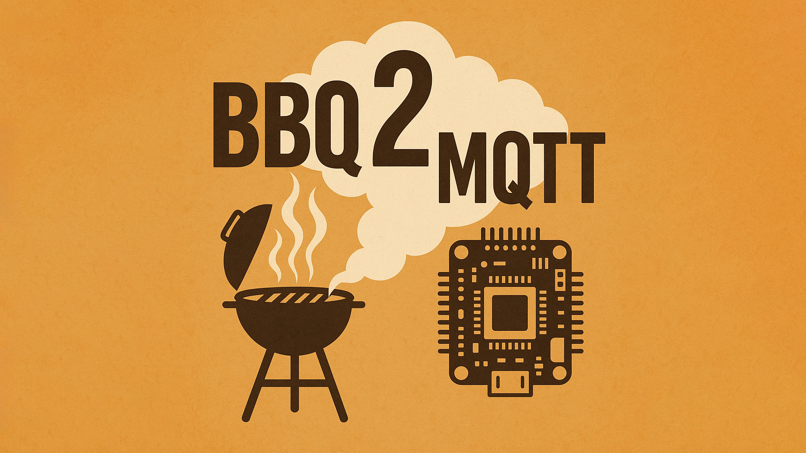

# BBQ2mqtt

Decode Maverick ET-73(2/3) BBQ thermometer packets on an ESP32 and publish readings over MQTT. Includes WiFi configuration via WiFiManager and NTP time sync for readable timestamps.


## Table of Contents
- [Overview](#overview)
- [Hardware](#hardware)
- [Build & Upload (PlatformIO)](#build--upload-platformio)
- [First Run & WiFi/MQTT Configuration](#first-run--wifimqtt-configuration)
- [First Run & WiFi/MQTT Configuration](#first-run--wifimqtt-configuration)
- [MQTT](#mqtt)
- [Serial Monitor](#serial-monitor)
- [Dependencies](#dependencies)
- [Acknowledgements](#acknowledgements)
- [Troubleshooting](#troubleshooting)

## Overview
- RF: 433.92 MHz OOK (Manchester, ~2 kbps)
- Publishes probe readings (probe1/probe2) to MQTT
- WiFi and MQTT configured at runtime via WiFiManager captive portal
- Built with PlatformIO for `esp32dev` and Arduino framework

## Hardware
- ESP32 DevKit (board: `esp32dev`)
- 433.92 MHz OOK receiver module (prefer superheterodyne for stability)
- Wiring:
  - Receiver `DATA` → ESP32 `GPIO 23`
  - Receiver `VCC` → `3.3V`
  - Receiver `GND` → `GND`

Keep receiver leads short and away from noise sources for best reception.

## Build & Upload (PlatformIO)
Requirements:
- VS Code + PlatformIO IDE, or PlatformIO Core (CLI)

Commands (CLI):
```
# Build
pio run -e esp32dev

# Flash device (put ESP32 in download mode if needed)
pio run -e esp32dev -t upload

# Open serial monitor @ 115200 baud
pio device monitor -b 115200
```
Configuration is defined in `platformio.ini` (platform `espressif32`, board `esp32dev`, Arduino framework, required libs).

## First Run & WiFi/MQTT Configuration
The firmware uses WiFiManager to simplify setup:
- On first boot or when WiFi credentials are missing/invalid, a configuration portal opens.
- Connect to the portal network shown in the serial log, then follow the on-screen form to enter:
  - MQTT server (host/IP)
  - MQTT port (default `1883`)
  - MQTT user (optional)
  - MQTT password (optional)
  - MQTT base topic (default `bbq2mqtt`)
  - NTP server (default `pool.ntp.org`)
- Settings are saved to NVS (`Preferences` namespace `bbq2mqtt`) and reused on subsequent boots.

Tip: If you need to reconfigure, clear saved settings or trigger WiFiManager’s config portal (see serial prompts or add your preferred trigger method).

## MQTT
- Default base topic: `bbq2mqtt` (can be changed in the portal)
- The firmware publishes current probe readings for integration with home automation systems.
- Use an MQTT client or your broker’s UI to verify messages after configuration.

## Serial Monitor
At `115200` baud, the firmware logs decoding status, WiFi/MQTT connection state, and parsed probe values. Use this to verify RF reception and network setup.

## Dependencies
Handled by PlatformIO (`platformio.ini`):
- WiFiManager (@tzapu)
- PubSubClient (@knolleary)
- AsyncTCP
- ESPAsyncWebServer

## Acknowledgements
- Thanks to the Maverick ET-733 RF project by milaq for inspiration and protocol details: https://github.com/milaq/maverick_et-733_rf
- Thanks to the grillsportverein.de community for the original idea and a code template that helped kick-start this implementation.

## Troubleshooting
- No packets: verify wiring (GPIO 23) and receiver power; try moving the receiver for better signal; ensure you’re using 433.92 MHz.
- Portal not visible: open serial monitor to see the portal SSID/IP; power-cycle the device; ensure it isn’t already connected to WiFi.
- MQTT not receiving: check broker address/port/credentials and base topic; confirm the ESP32 has IP connectivity.
